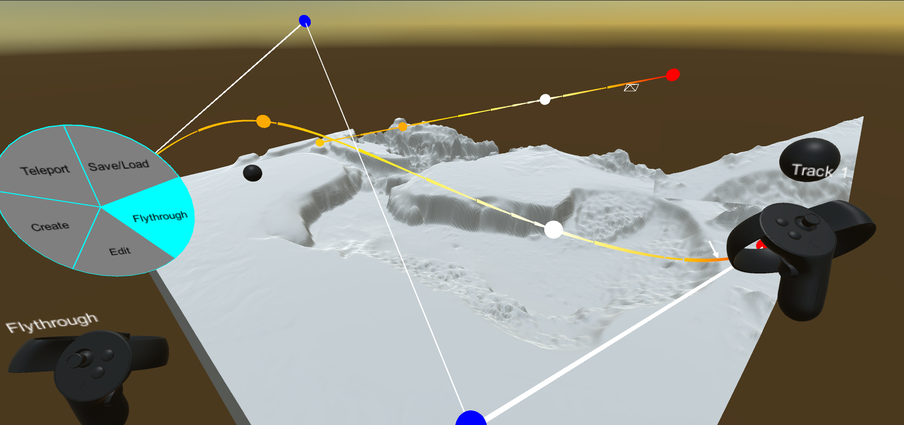

# VRDolly-UnityPackage

A camera flythrough editor designed by David Kinney for use by the IVLab team.

## Necessary Dependencies
Please add the following dependencies to your project before using VRDolly in a project scene:
1. [IVLab VisTools](https://github.umn.edu/ivlab-cs/VisTools-UnityPackage.git)
2. [Newtonsoft JSON](https://github.umn.edu/ivlab-cs/NewtonsoftJson-UnityPackage.git)
3. For VR usage, you will also need to install the "XR Plug-in Management" package from within your project's "Edit/Project Settings" menu and then check the box for the Oculus-specific plugin.

## Adding VRDolly to a Scene:
In order to get set your Unity scenes ready to use VRDolly, follow these steps:
1. Import the necessary dependencies into your project along with VRDolly itself.
2. Drag and drop the "VRDolly System" prefab from "Packages/IVLab VRDolly/Runtime/Prefabs" into a Unity scene.
3. Open up the VRDolly System's prefab hierarchy and locate the "Script Anchor" GameObject.
4. In the Script Anchor's inspector window, select a GameObject for the State Manager's Scene variable. This will anchor the tracks you create to this GameObject. If your scene is in world space and isn't attached to a single GameObject, you can simply create an empty GameObject with a uniform scale and assign this instead.
5. In the State Manager, select the input method that you would like to use from the drop-down menu.
6. After selecting your desired input method, disable all the input scripts except the one you wish to use by unchecking the box in the top-left corner of their inspector sections.
7. In your desired input script, select left or right as your dominant hand from the drop-down menu.

## Using VRDolly:
The following sections discuss important aspects of the current control schemes for VRDolly.
### Controller Probes:
There are spherical probes attached to each controller which act as grip and trigger interactors when working with VRDolly's camera tracks. These probes can be moved independently from their controllers' own positions by simultaneously holding the grip buttons and moving the thumbsticks. This will allow the probes to move forward/back/left/right with respect to their controller's orientation. Additionally, the positions of the probes can be locked and unlocked by pressing down on their corresponding controller's thumbstick.
### Snap-Turning:
For ease of use in VR, snap-turning can be performed by moving the dominant controller's thumbstick left or right. This action is available in all of VRDolly's different states.
### Radial State Menu:
VRDolly's functionality is split into different states which can be accessed by a radial menu on the user's recessive controller. In order to switch states, the user can use their recessive controller's thumbstick to select different states from the menu. Each state is described in more detail below...

#### Teleport:
The teleport state allows the user to move around the scene using snap teleportation. A teleport is started once the user holds down the trigger button on either of their controllers. This will begin casting a disk into the scene which steadily moves away from the controller that the user started the cast with. Once the user releases their controller's trigger, they are instantly teleported to the disk's location.
#### Create:
The creation state allows the user to instantiate new track pairs for their flythrough. Upon entering this state, the user can set four points sequentially by moving their probes to the desired starting locations and confirming by pressing their controller triggers. Once the four points are set, the first two are used as the endpoints for a position-track and the remaining two are used for the corresponding look-track. The user can repeat this process as many times as they want to in order to instantiate more than one pair. Exiting the state early will reset any points that the user had set down before a track pair could be created.
#### Edit:
The edit state allows the user to adjust, expand, and delete existing track pairs using their controller probes. To begin editing a track, the user can select a control point with a probe using the corresponding controller's trigger, or select a checkpoint using a probe and the corresponding controller's grip. Selecting a checkpoint also allows the user to increase or decrease its speed using the corresponding controller's thumbstick y-axis (it is highly recommended to lock the controller probes when adjusting checkpoint speeds). Once a point is selected, it will move with the probe until the trigger or grip is released depending on the point's type. While both controller probes are able to select track points, each controller's primary and secondary buttons have different usage contexts when points are selected. When a track point is selected by the dominant controller, the primary button adds a new control point whereas pressing the secondary button adds a new checkpoint. Conversely when a track is selected by the recessive controller, pressing the primary button deletes the currently held point (if it isn't an endpoint) while pressing the secondary button deletes the entire track pair. Also note that track endpoints function as both control points and checkpoints and function differently based on whether they are selected with a trigger or grip. Finally, note that checkpoints on look-tracks are automatically set to mimic checkpoints on their corresponding position-tracks and cannot be selected or edited directly.
#### Flythrough:
The flythrough state allows the user to run a camera along their current track setups and watch its footage on a screen attached to their dominant controller. The footage loops along the currently selected track pair and the user can adjust which pair they are currently viewing with the y-axes on their controller thumbsticks. Note that this state cannot be entered if there are no tracks pairs currently in the scene.
#### Save/Load:
The save/load state allows the user to save and load track configurations from their project's persistent data path. The user can browse their currenty saved configurations in their persistent data path with the y-axis of their dominant controller's thumbstick with the path and name of the file being displayed above it. After choosing a pre-existing file or the "new" slot, pressing the dominant controller's primary button will save/overwrite the current track configuration to that location, pressing the dominant controller's secondary button will load the file's configuration into the scene, and pressing the recessive controller's primary button will delete the selected file.

### Mouse/Keyboard Input Mapping:
Due to the limited degrees of freedom available with a mouse and keyboard when used in a VR environment, VRDolly is currently limited to a context switching system that allows the user to move each controller and the headset individually when using a mouse and keyboard. The control-mapping for each "device" is outlined below...

#### Headset (F3 to enable):
When the user switches to the headset's context, they are able to move forward/left/back/right with W/A/S/D respectively and up/down with SPACE/LShift respectively. The headset's orientation can be adjusted by moving the mouse while also holding down the middle mouse button. These movement controls are independent of the teleport state and meant for finer adjustments, but it is entirely possible to traverse a scene while using them exclusively.

#### Dominant/Recessive Controllers (F1/F2 to enable):
When the user switches to one of the controllers' contexts, the same movement controls from the headset context are applicable (W/A/S/D and SPACE/LShift) with orientation handled by free-hand mouse movement. Thumbstick movements are handled by the arrow keys (UP/DOWN/LEFT/RIGHT), the primary buttons are set to 1, the secondary buttons are set to 2, pressing down on the thumbsticks is set to the middle mouse button, triggers are set to the left mouse button,and grips are set to the right mouse button.
